.. cdm-mapper documentation master file, created by
   sphinx-quickstart on Wed May  5 14:03:54 2021.
   You can adapt this file completely to your liking, but it should at least
   contain the root `toctree` directive.

CDM-mapper toolbox documentation
================================

The **cdm** (cdm-mapper) is a python3_ tool designed to map observed meteorological variables and its associated metadata from a data model (schema_) to the C3S CDS Common Data Model (CDM_) format or **imodel** as called in this tool.

Tool overview
=============

    Simplified workflow of the main function in the tool

Input data
==========

``imodel``
----------

An ``imodel`` consist of a collection of `.json` files (or `python dictionaries`_ ) and python functions (``imodel.py``) that specify how a given pandas.DataFrame_ containing marine meteorological data, should be organise and map to the CDM_ format.

The CDM_ format splits meteorological reports into **header** and **observational records**, separating the data into different tables/files and column order. An ``imodel`` therefore consist of the following files:

1. ``header.json``: maps variables in the data that can provide information about the source of each meteorological report (e.g. profile configuration, station configuration and source configuration)

2. ``observations-variable.json``: this contains the mapping information for the observed variable and also important metadata information, like original value, original units. (e.g. ``observations-at.json`` will contain specific information about the sensor used to measure the air temperature, units, sensor height, etc)

3. ``imodel.py``: is a python script containing a full set of transforming functions. Each function has a specific role, to transform a variable or a parameter into a format compatible with the CDM format (e.g. all temperatures in the CDM format should be given in Kelvin as stated in the CDM_ manual.

4. ``__init__.py``: python file required to access subpackages and class functions inside ``imodel.py``.

``pandas.Dataframe``
--------------------

The data to map must have the following structure:

1.	Be a pandas.DataFrame_ (DF) with the data values organised into sections and/or columns.
2.	Attributes stored in the ``pandas.Dataframe`` as a `python dictionary`_ describing a simplified version of the input data model or schema.

.. note:: The cdm-mapper relies on the output of the mdf_reader_ toolbox. Please read more on the mdf_reader documentation page to understand the structure of the ``pandas.Dataframe`` or **schema** containing the meteorological data to map.

Output data
===========

The output of the main mapper function is a `python dictionary`_ with the ``{cdm_table_name : cdm_table_object}`` pairs of data, that can be afterwards printed to an ascii file. Each file or python dictionary contains one of the CDM tables for which a mapping has been defined in the ``imodel``. Optionally, the intermediate mapped python object can also be accessed.

With the above settings this tool supports mapping to the CDM format by:

   - Direct mapping from an ``imodel`` element
   - Direct assignment from the ``imodel`` elements attributes
   - Assignment of a default value
   - ``imodel`` elements transformation including any combination of the following: element combination, simple parameterization (input keyword arguments) or``imodel`` elements attributes.
   - ``imodel`` or **CDM** coded values:

         - From ``imodel`` key to **CDM** key
         - From ``imodel`` key to **CDM** value: done by transforming functions in ``imodel.py``
         - From ``imodel`` value to **CDM** key: also done by transforming functions in ``imodel.py``

.. note:: Click on next to understand how to install the tool and its capabilities.

.. toctree::
   :maxdepth: 2
   :glob:
   :hidden:
   :caption: Guide

   tool-set-up.rst
   getting-started.rst
   how-to-register-a-new-data-model-mapping.rst
   cdm-tables-mapping-files-and-descriptors.rst
   example_notebooks/CDM_mapper_example_deck704.ipynb
   contributing
   authors
   api
   history

About
-----

:Version: v2.0 (unpublished)

:Citation: zenodo link

:License: actually MIT

:Authors:
         David Berry, Irene Perez Gonzalez, Beatriz Recinos Anreas Wernecke and Ludwig Lierhammer

|logo_c3s| |logo_NOC| |logo_ICOADS|

.. include:: hyperlinks.rst
